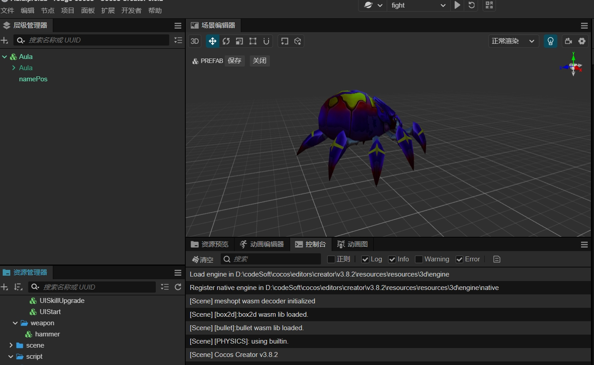
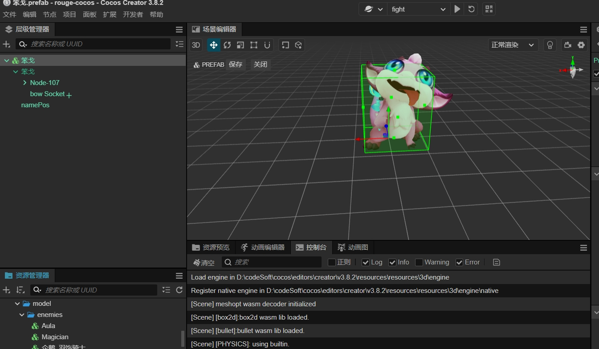

<special>
</special>

## Upcoming 3D Roguelike Game Development - A Java Backend Developer's Journey

I am currently working on a 3D roguelike game, reminiscent of the classic Warcraft III RPG maps like "伏魔战记". Although my background is in Java backend development, I have picked up frontend and modeling skills along the way and am now learning Cocos to make the switch to game development.

## Game Features Implemented So Far:

- **Monster AI**: Basic attack patterns and behaviors for in-game creatures.
- **Ranged AI**: Logic for monsters to engage players from a distance.
- **Skill Configuration**: A system that allows for the customization of abilities.
- **Character Selection**: Players can choose from a variety of characters.

## Work in Progress:

While the game is functional, there is plenty of room for optimization. My skills in frontend development, 3D modeling, and Cocos are still growing, and I'm looking forward to improving the final product.

## Preview:

Below are some screenshots of the monsters and a gameplay video to give you a glimpse into the current state of the project.

[Game address](https://cocos1.zeabur.app/)

The first time it takes 3 minutes to load domestically, approximately 170M.

## Join the Discussion:

I invite everyone to join in the discussion and share their thoughts on the game's development. Whether you're a fellow developer with advice or a potential player with feedback, your input is valuable.

## Contact:

- **Email**: [interestingol@foxmail.com](mailto:example@example.com)
- **Gitee**: [@yourusername](https://gitee.com/yourusername)
