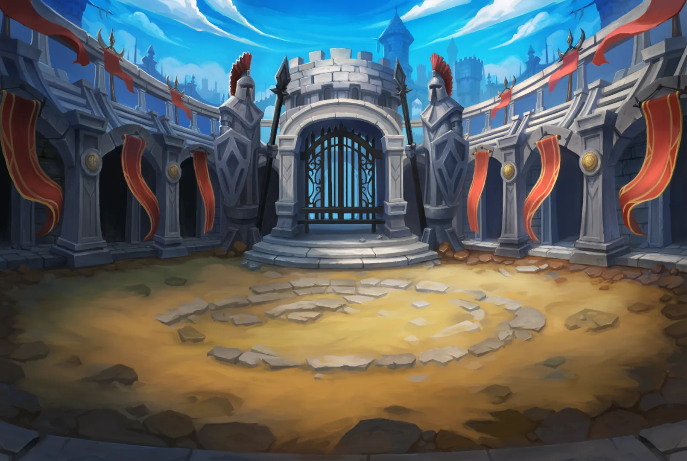

<special>
</special>

## Imitation Practice of WeChat Mini Game "Charge Little Soldier" - A Hardworking Game Developer's Journey

As a hardworking employee, I'm practicing by imitating the WeChat mini game "Charge Little Soldier" in my spare time. Here are some details about my practice project.

## Game Features and Implemented Functions:

- **Basic Gameplay**: Soldiers from both sides will automatically attack each other until one side destroys the enemy's base.
- **Scoring System**: Players earn resources by killing units on the battlefield.
- **Class System**: There are three professions available, but for now, only the Archer class is showcased due to taking a lazy approach to the presentation.

## Work in Progress:

The basic framework of the game is already in place, but there is still much to refine. I will continue to polish the gaming experience and add more features.

## Preview:

Here are some background and material images of the game to give you a preliminary understanding of the game's appearance.

## Game Experience:

You can click the following link to experience the game and see how a little soldier bravely charges through numerous obstacles.

[Game Experience Address](https://goanthony.netlify.app/)

The first loading takes about 1 minute

## Join the Discussion:

I invite everyone to join in the discussion and share their thoughts on the game's development. Whether you're a fellow developer with advice or a potential player with feedback, your input is valuable.

## Contact:

- **Email**: [interestingol@foxmail.com](mailto:example@example.com)
- **Gitee**: [@yourusername](https://gitee.com/zgn_13200126222)
