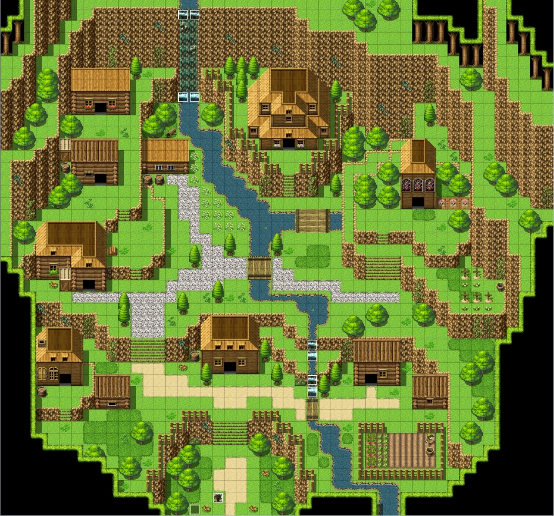
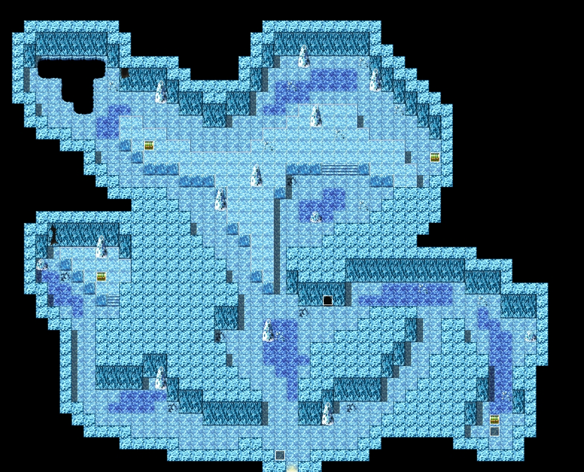
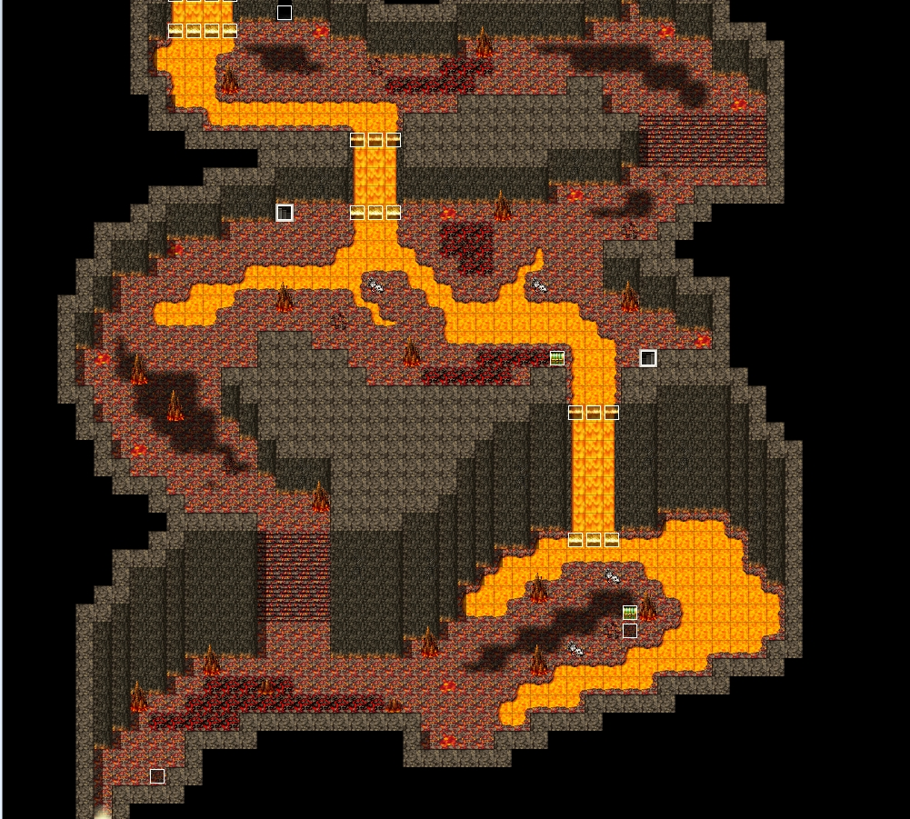
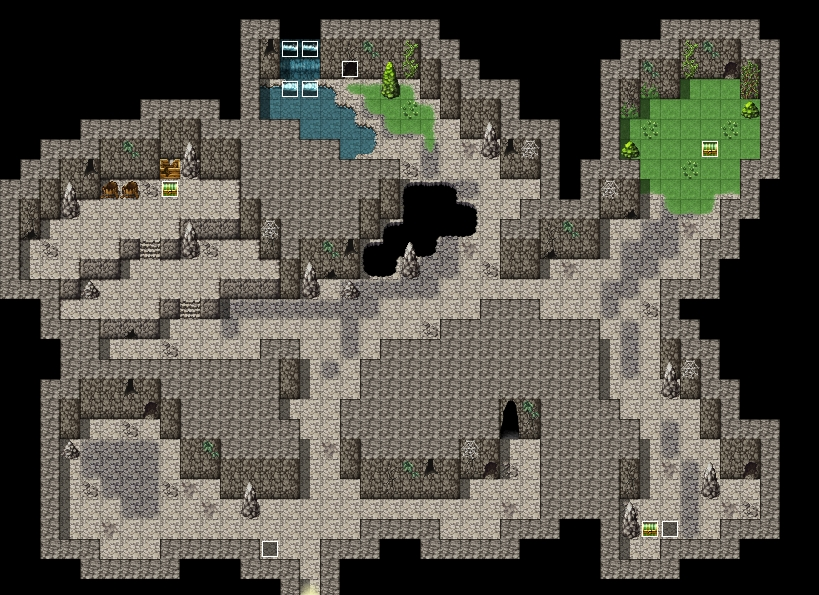
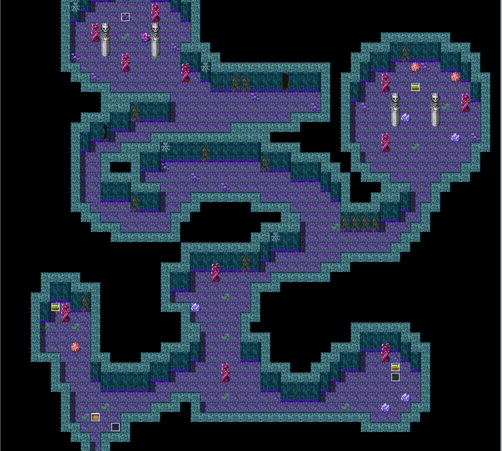

<special>
</special>

## rouge demo

Perhaps the fantasy of having my own world began as early as middle school or high school, and over the years, a 30,000-word outline gradually took shape through annual refinements. Now, I feel the time has come.

Initially, it was envisioned as a massive visual game, but halfway through development, I realized its sheer scale was overwhelming. Consequently, I extracted the core gameplay mechanics and created a demo instead.

Here's a brief overview of the current pages:

So far, only the Tester and the Blade Master characters have been tested, with the Wolf and Bear characters likely serving more as decorative placeholders.

There are 20 weapons available.

Regarding auras, there are 27 types in total, with typically 3 tiers of advancement for each.

There are 24 types of minions, featuring 9 different elemental weaknesses/strengths for strategic combat.

Armor-wise, there are 32 pieces, though I haven't had the chance to thoroughly test them all and prefer not to elaborate further at this point.

Further development and details are yet to be finalized. For a more comprehensive look, please feel free to reach out via email. I'll make time to elaborate and refine the information as needed.

[Game address](https://rpg1.zeabur.app/)
